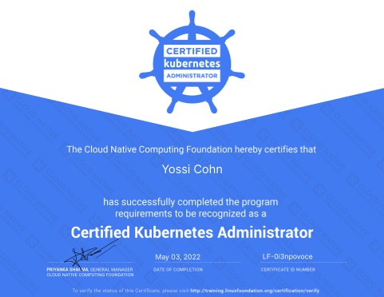

---
title: "Certifications & Education"
date: 2022-08-31T20:50:15+03:00
draft: true
headless: true
---

<b></b>
<b></b>
<b></b>

## Professional 
<b></b>
<b></b>
<b></b>

###   **B.Sc, Mathematics & Computer Science** 

- The Hebrew University of Jerusalem
- 1998 - 2001

<b></b>
<b></b>
<b></b>
### **Machine Learning**

- Coursera Course Certificates

- Issued Aug 2016 · No Expiration Date

- Credential ID `T64Z8BE9ME9P`

- [credential](https://www.coursera.org/account/accomplishments/verify/T64Z8BE9ME9P)

<b></b>
<b></b>
<b></b>

### **Linux Foundation - Kubernetes Fundamentals LFS258**
- Issued Nov 2021 · No Expiration Date
- Credential ID `LF-hij2pw05gi`

<b></b>
<b></b>
<b></b>

### **Linux Foundation Certified Kubernetes Administrator - CKA**
- May 2022

<b></b>
<b></b>
<b></b>

## Sport & Hobbies

<b></b>
<b></b>
<b></b>

### **Aikido Shodan**
- AIKIKAI INTERNATIONAL, INC.
- Issued Jan 2016 · No Expiration Date